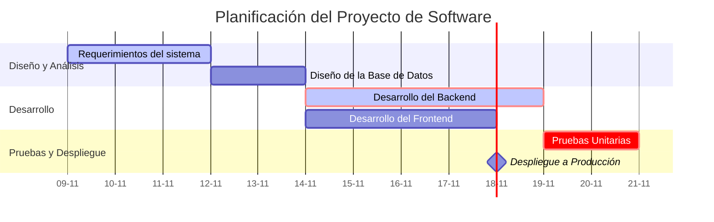

```mermaid
gantt
    title Planificación del Proyecto de Software
    dateFormat  YYYY-MM-DD
    axisFormat  %d-%m
    tickInterval 1day

    section Diseño y Análisis
    Requerimientos del sistema :active, req1, 2026-11-09, 3d
    Diseño de la Base de Datos  : bdb, after req1, 2d

    section Desarrollo
    Desarrollo del Backend      :crit, active, back1, after bdb, 5d
    Desarrollo del Frontend     :front1, after bdb, 4d

    section Pruebas y Despliegue
    Pruebas Unitarias          :crit, after back1, 2d
    Despliegue a Producción    :milestone, after front1, 0d
```
